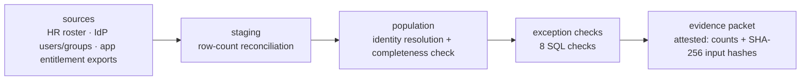

# IAM Access Review

> A user access review (UAR) data pipeline I'm building: SQL-based population completeness,
> reconciliation, and exception detection over multi-source identity data.
> Audit evidence as a data product.

> [!WARNING]
> **Design-stage (v1.0 in progress).** This repository currently documents the design,
> control mappings, and SQL check specification. The implementation (ingest, SQL check
> engine, synthetic fixtures, CLI) is **not yet committed**. The `python -m uar_pipeline`
> quickstart below describes the *planned* interface, not a currently runnable command.

## Why This Exists

IT controls depend on reliable data: complete review populations, reconciled
sources, and repeatable evidence. I want a quarterly UAR built the way a
controls data engineer would build it. Staged source data, SQL validation
checks, and an auditor-ready evidence packet with completeness attestations.
Not the spreadsheet-and-screenshot workflow most access reviews run on.

The output is the artifact an auditor asks for: a defensible review
population with documented lineage, typed exceptions, and proof the inputs
were not altered between extraction and review.

## Controls Addressed

| SOX ITGC | NIST 800-53 Rev 5 | SOC 2 TSC | Validation Method |
|---|---|---|---|
| Access to Programs and Data (UAR) | AC-2, AC-2(3) | CC6.1–CC6.3 | population completeness + exception checks |
| Terminated-user removal | AC-2(3) | CC6.2 | HR join: terminated-but-active detection |
| Privileged access restriction | AC-6(7) | CC6.1 | recursive group flattening → effective privileged reach |

## What It Checks

The control logic is SQL-first. Python only stages the data and orchestrates.
Eight checks over the staged sources:

1. **Source-to-staging row-count reconciliation.** Every extracted row landed.
2. **Population completeness.** Every enabled account ties to an identity.
3. **Terminated-but-active.** HR-terminated identities still holding enabled accounts.
4. **Orphaned accounts.** Accounts with no matching identity in any source.
5. **Dormant access.** Enabled accounts with no recent activity.
6. **Ownerless groups.** Groups with no accountable owner of record.
7. **Direct assignments.** Entitlements granted outside group membership.
8. **Effective privileged reach.** Recursive-CTE nested-group flattening to
   compute who holds privileged access through nesting, not only direct members.

## Quickstart

```bash
git clone https://github.com/0xBahalaNa/iam-access-review
cd iam-access-review
python -m uar_pipeline --fixtures fixtures/ --out evidence/
```

Python 3, standard library only (`sqlite3`, `csv`, `json`, `hashlib`,
`argparse`). No dependencies to install. Once implemented, the fixtures will be fully
synthetic so the pipeline is clone-and-run.

## Sample Output

The evidence packet (`evidence/`) contains three artifacts:

- **`population.csv`.** The identity-resolved review population: every
  account, its source system, its matched identity, and its review status.
- **`exceptions.csv`.** Typed exceptions (one row per finding, tagged by
  check), ready for reviewer disposition.
- **`summary.json`.** Run attestations: per-source row counts
  (extracted vs. staged), completeness results, and SHA-256 hashes of every
  input file, so the run is provably complete, accurate, and repeatable.

```json
{
  "run_attestation": {
    "sources_ingested": 4,
    "row_counts": { "hr_roster": { "extracted": 112, "staged": 112 } },
    "input_hashes": { "hr_roster.csv": "sha256:..." },
    "population_completeness": "PASS",
    "exceptions_by_check": { "terminated_but_active": 3, "orphaned_account": 2 }
  }
}
```

*(Illustrative. The final schema ships with v1.0.)*

## Data Lineage



Every hop is validated: sources reconcile into staging by row count, the
population is checked for completeness against all sources, and the final
packet attests to both. That is the lineage an auditor can follow without
trusting the tool.

## Design Decisions

- **SQL as the control engine.** Checks are SQL views over staged tables, not
  Python conditionals. The control logic is readable, testable, and portable
  to a real warehouse.
- **Standard library only.** `sqlite3` ships with Python; a reviewer can clone
  and run the pipeline in 30 seconds with zero setup.
- **Synthetic fixtures with seeded failure modes.** Nested groups, stale
  records, missing owners, direct assignments, and inconsistent identifiers
  are deliberately planted. The messy-identity-data problems a real UAR hits,
  with zero data-sensitivity questions.
- **Evidence repeatability.** Row-count attestations plus SHA-256 input hashes
  make the packet reproducible: same inputs, same evidence, provably.
- **Deliberately out of scope:** dashboards, dbt/Airflow/Databricks, live
  system connectors, web UI. Fixtures-only keeps the pipeline auditable
  end-to-end in one sitting.
