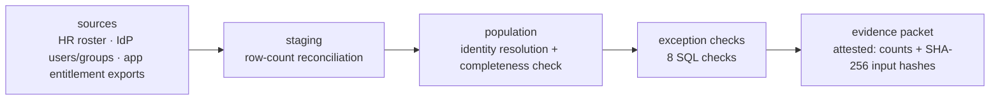

# IAM Access Review

> A user access review (UAR) data pipeline I built: SQL-based population completeness,
> reconciliation, and exception detection over multi-source identity data.
> Audit evidence as a data product.

## Why This Exists

IT controls depend on reliable data: complete review populations, reconciled
sources, and repeatable evidence. I want a quarterly UAR built the way a
controls data engineer would build it. Staged source data, SQL validation
checks, and an auditor-ready evidence packet with completeness attestations.
Not the spreadsheet-and-screenshot workflow most access reviews run on.

The output is the artifact an auditor asks for: a defensible review
population with documented lineage, typed exceptions, and proof the inputs
were not altered between extraction and review.

## Controls Addressed

All eight SQL checks ship. The table is the commercial crosswalk this packet
is built to satisfy.

| SOX ITGC | NIST 800-53 Rev 5 | SOC 2 TSC | Validation Method |
|---|---|---|---|
| Access to Programs and Data (UAR) | AC-2, AC-2(3) | CC6.1–CC6.3 | population completeness + exception checks |
| Terminated-user removal | AC-2(3), PS-4 | CC6.2 | HR join: terminated-but-active detection. The HR termination event is the PS-4 boundary; AC-2(3) is the account-disable that should follow. The check finds where that handoff failed |
| Privileged access restriction | AC-6(7) | CC6.1 | recursive group flattening → effective privileged reach |

The packet is the audit record an AU-6 review examines: attested counts,
SHA-256 input hashes, and typed exceptions.

## What It Checks

The control logic is SQL-first. Python stages the data and writes the packet.
Each check is a view in `uar_pipeline/checks.sql`. The comment above the view
is the auditor-readable rationale.

1. **Source-to-staging reconciliation.** Completeness of the extract, not of
   identities. Every extracted row is still staged or rejected.
2. **Population completeness.** Every enabled IdP user ties to an HR identity.
3. **Terminated-but-active.** HR-terminated identities still holding enabled
   accounts.
4. **Orphaned accounts.** Enabled app accounts with no matching IdP identity.
5. **Dormant access.** Enabled accounts with no activity on or after the
   fixture cutoff `2026-04-01`.
6. **Ownerless groups.** Groups with no accountable owner of record.
7. **Direct assignments.** Admin-named entitlements granted outside
   privileged-group membership.
8. **Effective privileged reach.** Recursive-CTE nested-group flattening:
   who holds privileged access through nesting, not only as a listed member.

Known limit: privileged *entitlements* match `entitlement_name LIKE '%admin%'`
(case-insensitive). Privileged *groups* are the `privileged` column on
`idp_groups`, not a name pattern.

The review population is enabled IdP users and enabled app accounts only.
Disabled accounts hold no access, so they are out of scope.

## Quickstart

```bash
git clone https://github.com/0xBahalaNa/iam-access-review
cd iam-access-review
python -m uar_pipeline --fixtures fixtures/ --out evidence/
```

Python 3, standard library only (`sqlite3`, `csv`, `json`, `hashlib`,
`argparse`). No dependencies to install. The fixtures are synthetic.

To inspect the staged database instead of writing the packet:

```bash
python -m uar_pipeline.ingest --fixtures fixtures/ --db build/uar.db
python -m uar_pipeline.checks --db build/uar.db
```

## Sample Output

The committed `evidence/` packet is the drift alarm. Regenerating it with the
quickstart command and getting an empty `git diff` proves the sample still
matches the code.

- **`population.csv`.** Every enabled IdP user and every enabled app account:
  source system, account id, resolved identity, and `review_status`.
  `review_status` is the comma-joined sorted list of account-level checks that
  flagged the row, or `clear`. File-level and group-level findings
  (reconciliation, ownerless groups) do not appear there; they are not
  account-level. The SQL builds the string with `group_concat` over an ordered
  subquery, not `group_concat(... ORDER BY ...)`, so `CREATE VIEW` works on
  SQLite before 3.44. A double-run produces byte-identical files.
- **`exceptions.csv`.** One row per finding, five columns (`check_name`,
  `exception_type`, `source_system`, `record_id`, `detail`).
- **`summary.json`.** Per-source extracted/staged/rejected counts, SHA-256 of
  every input file, `reconciliation` derived from the check view, exception
  counts for all eight checks (zeros included), and `population_rows`.
  There is no timestamp. Repeatability is by construction: same fixtures,
  same packet. The only date is the fixture as-of literal `2026-06-30`.

On this pack: 53 population rows, 15 exceptions. `U008` is flagged by both
`check_nested_privileged_reach` and `check_terminated_active`. `sf-016` is
orphaned (`idp_user_id` empty).

```json
{
  "as_of_date": "2026-06-30",
  "sources": {
    "hr_roster.csv": {
      "extracted": 25,
      "staged": 24,
      "rejected": 1,
      "sha256": "3c983c2130c891dd0c4f5e16197d4ddd79e188d293b91921f9ff59f4a49b45b3"
    },
    "idp_users.csv": {
      "extracted": 25,
      "staged": 25,
      "rejected": 0,
      "sha256": "b6ebc5867399fad623dfbcecca5407c4df51c511e1d7d3791c0bff4062072058"
    },
    "idp_groups.csv": {
      "extracted": 8,
      "staged": 8,
      "rejected": 0,
      "sha256": "c20f0440b731da746f07d4fa004fc7f6468bc31bbfcf12064f2a439f9541f002"
    },
    "idp_group_members.csv": {
      "extracted": 40,
      "staged": 40,
      "rejected": 0,
      "sha256": "6380eae7bfc55a05dba063d09025df133d2ee30fe54e6d4b00511fc58839258e"
    },
    "app_entitlements_salesforce.csv": {
      "extracted": 16,
      "staged": 16,
      "rejected": 0,
      "sha256": "2efb5d56c528d967a35dc4ec91f0a57824399bb93f2fb1ee793ac7d1a48caf42"
    },
    "app_entitlements_github.csv": {
      "extracted": 12,
      "staged": 12,
      "rejected": 0,
      "sha256": "26704ba232e150fa960bad183fc7a7d9fca099a9127e8e7bf21252fb2c83059d"
    }
  },
  "reconciliation": "PASS",
  "population_rows": 53,
  "exceptions_by_check": {
    "check_completeness": 1,
    "check_direct_assignment": 1,
    "check_dormant": 2,
    "check_nested_privileged_reach": 6,
    "check_orphaned_accounts": 2,
    "check_ownerless_groups": 1,
    "check_reconciliation": 0,
    "check_terminated_active": 2
  },
  "total_exceptions": 15
}
```

## Data Lineage



Every hop is validated: sources reconcile into staging by row count, the
population is checked for completeness against all sources, and the final
packet attests to both. That is the lineage an auditor can follow without
trusting the tool.

## Design Decisions

- **SQL as the control engine.** Checks are SQL views over staged tables, not
  Python conditionals. The control logic is readable, testable, and portable
  to a real warehouse.
- **Standard library only.** `sqlite3` ships with Python; a reviewer can clone
  and run the pipeline in 30 seconds with zero setup.
- **Synthetic fixtures with seeded failure modes.** Nested groups, stale
  records, missing owners, direct assignments, and inconsistent identifiers
  are deliberately planted. The messy-identity-data problems a real UAR hits,
  with zero data-sensitivity questions.
- **Evidence repeatability.** No timestamp in the packet. Row-count
  attestations plus SHA-256 input hashes make the run a pure function of the
  fixtures. The committed `evidence/` sample is the drift alarm: regenerate
  it and `git diff` is empty.
- **Deliberately out of scope:** dashboards, dbt/Airflow/Databricks, live
  system connectors, web UI. Fixtures-only keeps the pipeline auditable
  end-to-end in one sitting.
